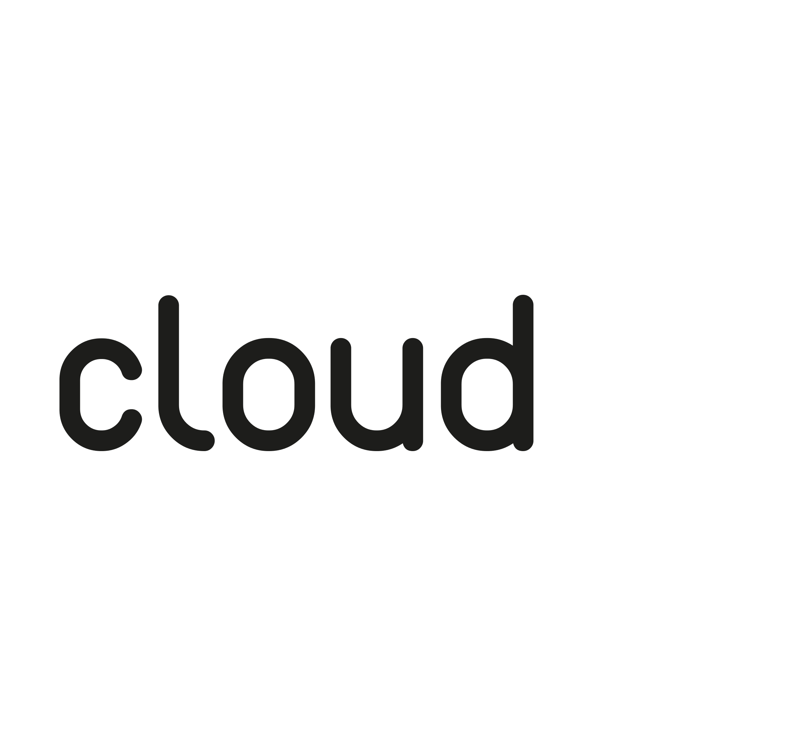

Cloudbox is an Ansible playbook for deploying a cloud media server stack on an Ubuntu server with the use of Docker containers.

This project is limited to specifically 16.04 Ubuntu LTS and AMD64/Intel64 (no ARM support) machines and designed for fresh systems. Do not install on an already setup server, or prepare for unintended consequences.

_If you find this project helpful, feel free to make a small donation via [PayPal](https://www.paypal.me/l3uddz), bitcoin: 15sKj1qi5PWvviTbCDJJKYoeQBQRv535Gb or litecoin: LRx1Z4AvKUJWa9pKnHrcsMemhG8S5w7uLp. Other forms of support are also appreciated (e.g. bugfixes/pull requests to develop branch, etc)._

## Cloudbox Install Types

| What's Installed                                                |    Full     |   Feeder    |    Plex     |
|:--------------------------------------------------------------- |:-----------:|:-----------:|:-----------:|
| [Docker][627bd283]                                              | ![Yes][yes] | ![Yes][yes] | ![Yes][yes] |
| [Plex][10952c53] ([docker][d369f92b])                           | ![Yes][yes] |             | ![Yes][yes] |
| [PlexPy][363c0adc] ([docker][cda70c13])                         | ![Yes][yes] |             | ![Yes][yes] |
| [Plex AutoScan][96e27fd1]                                       | ![Yes][yes] |             | ![Yes][yes] |
| [Sonarr][8ae81bb6] ([docker][a9b9645e])                         | ![Yes][yes] | ![Yes][yes] |             |
| [Radarr][8211f62c] ([docker][a9b9645e])                         | ![Yes][yes] | ![Yes][yes] |             |
| [NZBGet][2e2bad08] ([docker][a9b9645e])                         | ![Yes][yes] | ![Yes][yes] |             |
| [rTorrent][512b104c]/[ruTorrent][8d6ce857] ([docker][344a7c4b]) | ![Yes][yes] | ![Yes][yes] |             |
| [Jackett][1caa43a0] ([docker][a9b9645e])                        | ![Yes][yes] | ![Yes][yes] |             |
| [NZB Hydra][a0cc8c46] ([docker][a9b9645e])                      | ![Yes][yes] | ![Yes][yes] |             |
| [Rclone][b4cef019]                                              | ![Yes][yes] | ![Yes][yes] |             |
| [Plexdrive][0367302f]                                           | ![Yes][yes] | ![Yes][yes] | ![Yes][yes] |
| [Plex Requests - Meteor][458fc748] ([docker][0044f8e1])         | ![Yes][yes] |             | ![Yes][yes] |
| [Nginx Proxy][08902ab1]                                         | ![Yes][yes] | ![Yes][yes] | ![Yes][yes] |
| [Let's Encrypt Companion for Nginx Proxy][bb8ae44f]             | ![Yes][yes] | ![Yes][yes] | ![Yes][yes] |
| [Organizr][d328b256] ([docker][1e468891])                       | ![Yes][yes] | ![Yes][yes] |             |
| [Portainer][726e0b6f]                                           | ![Yes][yes] | ![Yes][yes] |             |
| [UnionFS][6e8f308f]                                             | ![Yes][yes] | ![Yes][yes] | ![Yes][yes] |
| [UnionFS Cleaner][f20acc3e]                                     | ![Yes][yes] | ![Yes][yes] |             |
| [Watchtower][a98faaaf]                                          | ![Yes][yes] | ![Yes][yes] | ![Yes][yes] |
| Misc tools and server tweaks (e.g. kernel, motd, mc, ngrok)     | ![Yes][yes] | ![Yes][yes] | ![Yes][yes] |

  [no]:.github/cross-mark.png
  [yes]:.github/check-mark.png

  [627bd283]: https://www.docker.com "Docker"
  [10952c53]: https://www.plex.tv "Plex"
  [d369f92b]: https://github.com/plexinc/pms-docker "Official Docker container for Plex Media Server"
  [363c0adc]: https://github.com/JonnyWong16/plexpy "PlexPy"
  [cda70c13]: https://github.com/linuxserver/docker-plexpy "linuxserver/plexpy"
  [96e27fd1]: https://github.com/l3uddz/plex_autoscan "Plex_AutoScan"
  [8ae81bb6]: https://sonarr.tv "Sonarr"
  [8211f62c]: https://radarr.video "Radarr"
  [2e2bad08]: https://nzbget.net "NZBGet"
  [a0cc8c46]: https://github.com/theotherp/nzbhydra "NZBHydra"
  [512b104c]: https://github.com/rakshasa/rtorrent/wiki "rTorrent"
  [8d6ce857]: https://github.com/Novik/ruTorrent "ruTorrent"
  [344a7c4b]: https://github.com/l3uddz/docker-rutorrent "forked version of linuxserver/rutorrent"
  [1caa43a0]: https://github.com/Jackett/Jackett "Jackett"
  [b4cef019]: https://rclone.org "Rclone"
  [0367302f]: https://github.com/dweidenfeld/plexdrive "Plexdrive"
  [6e8f308f]: http://manpages.ubuntu.com/manpages/zesty/man8/unionfs.8.html "UnionFS-Fuse"
  [f20acc3e]: https://github.com/l3uddz/unionfs_cleaner "UnionFS_Cleaner"
  [a98faaaf]: https://github.com/v2tec/watchtower "Watchtower"
  [458fc748]: https://github.com/lokenx/plexrequests-meteor "PlexRequests"
  [0044f8e1]: https://github.com/linuxserver/docker-plexrequests "linuxserver/plexrequests"
  [d328b256]: https://github.com/causefx/Organizr "Organizr"
  [1e468891]: https://github.com/linuxserver/docker-organizr "lsiocommunity/organizr"
  [726e0b6f]: https://portainer.io "Portainer"
  [a9b9645e]: https://github.com/hotio/docker-suitarr "hotio/suitarr"
  [08902ab1]: https://github.com/jwilder/nginx-proxy "Nginx Proxy"
  [bb8ae44f]: https://github.com/JrCs/docker-letsencrypt-nginx-proxy-companion "Let's Encrypt companion for Nginx Proxy"

\* Sonarr, Radarr, NZBGet, Jackett, and NZB Hydra use the latest releases, including beta and nightly builds.

## History

- See [Changelog](CHANGELOG.md)

## How To Guides

- See [Wiki](https://github.com/l3uddz/cloudbox/wiki)

## Credits

- l3uddz (creator)
- desimaniac (contributor)

## Contributing

1. Fork it.
1. Clone the project: `git clone http://github.com/<your_name>/cloudbox`
1. Create your feature branch (off of the develop branch): `git checkout -b my-new-feature develop`
1. Commit your changes: `git commit -am 'Added some feature'`
1. Push to the branch: `git push origin my-new-feature`
1. Submit a pull request.

## Community
- [Forum](https://forums.cloudbox.rocks/)
- [Slackchat](https://join.slack.com/t/cloud-box/shared_invite/enQtMjg0NTM4NTc2ODA1LTliOTdmMzM5YmNiZjU0ZDQxOWU0ZGQxN2E1MGE5NDIyM2VkZjE1MjQ1NmQ3ZjFhZTNhOGEzMmY1ZDViZTkyMzg)
